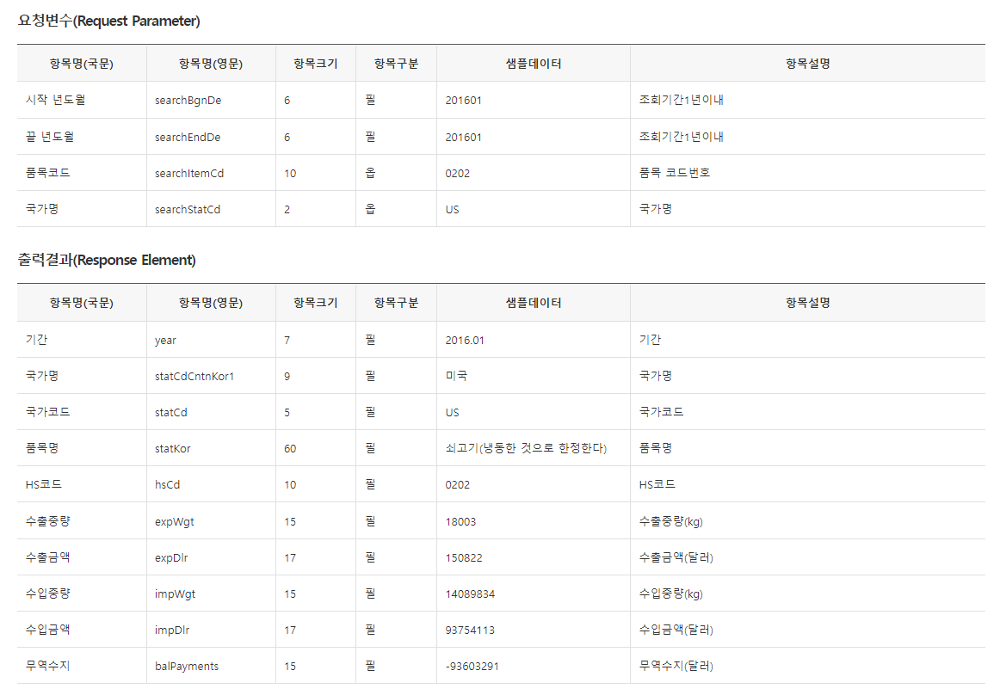

```{r include=FALSE}
Sys.setlocale("LC_ALL", locale = "korean")
```

## 공공데이터 포털의 open API

[공공데이터 포털](https://www.data.go.kr/)에서 제공하는 open API가 7천여개 정도 있으며 해당 사이트에서는 이용자들이 API를 쉽게 이용할 수 있도록 샘플코드를 다음과 같이 제공하고 있습니다.

```{r}
# install.packages("httr")
# 
# library(httr)
# GET('http://openapi.customs.go.kr/openapi/service/newTradestatistics/getNitemtradeList?
#     serviceKey=ServiceKey&searchBgnDe=201601&searchEndDe=201601&searchItemCd=0202&searchStatCd=US')

```

위 코드는 사실 이용하기 힘듭니다... 그래서 새로운 방법으로 API수집을 위한 코딩이 필요하죠. 이번 포스팅에서는 관세청 수출입실적 open API를 수집하는 함수를 만들어보겠습니다.

## 관세청 수출입실적

관세청 수출입실적은 아래 그림처럼 시작년도월, 끝년도월, 품목코드, 국가명을 요청하면 요청값에 맞는 수출입실적 데이터를 출력해주는 API입니다.



## API 수집 코드의 흐름

### url만들기

요청하는 url를 확인해보면 다음과 같습니다.

------------------------------------------------------------------------

[*http://openapi.customs.go.kr/openapi/service/newTradestatistics/getNitemtradeList?*](http://openapi.customs.go.kr/openapi/service/newTradestatistics/getNitemtradeList?)

*serviceKey=**ServiceKey**&*

*searchBgnDe=**201601**&*

*searchEndDe=**201601**&*

*searchItemCd=**0202**&*

*searchStatCd=**US***

------------------------------------------------------------------------

굵은 글씨만 바꿔서 url를 만들 수 있도록 하는 것이 첫번째 목표입니다. 각 요청값을 인자로 받아 요청url을 만들어주는 함수를 만듭니다.

```{r echo=TRUE}
one_getNitemtradeList <- function(ServiceKey, startpoint, endpoint, hscode, country){
  
    url <- paste0("http://openapi.customs.go.kr/openapi/service/newTradestatistics/getNitemtradeList?ServiceKey=",
                  ServiceKey,
                  
                  "&searchBgnDe=", startpoint,
                  "&searchEndDe=", endpoint,
                  "&searchItemCd=", hscode,
                  "&searchStatCd=", country)
    return(url)
}

myurl <- one_getNitemtradeList('ServiceKey', '201601', '201612', '0202', 'US')
myurl
```

여기서 paste0() 함수는 각 문자열을 빈칸없이 이어서 출력해줍니다.

```{r}
paste0('a', 'b', 'c')
```

### url을 이용하여 요청값 받기.

공공데이터포털에서 제공하는 API중 상당부분이 XML형식으로 제공하고 있습니다. 관세청 데이터도 마찬가지 입니다. 그러므로 xml파일을 읽기위한 "xml2"패키지를 사용해보겠습니다. 저는 블로그에 서비스키를 노출할 수 없으므로 xml파일로 저장하여 불러오겠습니다. 실제로는 read_xml(myurl)을 실행시키면 됩니다.

```{r}
library(xml2)
# read_xml(myurl)
myxml <- read_xml('myurl.xml')
myxml
```

xml을 쉽게 읽을 수 있을때까지 하위 노드로 이동합니다.

-   1번째 하위노드

```{r}
library(dplyr)
myxml %>% xml_children()
```

-   2번째 하위노드

```{r}
myxml %>% xml_children() %>% xml_children()
```

-   3번째 하위노드

```{r}
xml_expimp <- myxml %>% xml_children() %>% xml_children() %>% xml_children
xml_expimp
```

위처럼 3번째 하위 노드로 내려가면 <변수명>출력값</변수명> 형태의 출력값에 접근할 수 있습니다. 이제 데이터 프레임 형태로 정리하는 일만 남았습니다.

### 데이터 프레임으로 정리

xml_expimp의 첫번째 노드를 살펴보면 각 출력값마다 '/'이 포함되 있는 규칙을 발견할 수 있습니다.

```{r}
xml_expimp[1]
```

이를 xml_find_all()과 정규표현식을 이용해 다음과 같이 정리할 수 있습니다.

```{r}
temp_row <- xml_find_all(xml_expimp[1], './*')
temp_row
```

이제 출력명과 출력값을 나눌 차례입니다. xml_name()통해 <출력명>을 추출하고, xml_text()통해 출력값을 추출할 수 있습니다.

```{r}
temp_row %>% xml_name()
```

```{r}
temp_row %>% xml_text()
```

이를 tibble을 사용하여 데이터 프레임 형태로 정리하면,

```{r}
library(tibble)
tibble(idx = 1, key = temp_row %>% xml_name(), value = temp_row %>% xml_text())
```

이를 모든 노드에 적용하여 tibble로 만들어 줍니다.

```{r}
tmp1 <- lapply(seq_along(xml_expimp),
               function(x){
                 temp_row <- xml_find_all(xml_expimp[x], './*')
                 tibble(idx = x,
                        key = temp_row %>% xml_name(),
                        value = temp_row %>% xml_text()
                 ) %>% return()
                 }
               )
tmp1 %>% head(3)
```

각 tibble을 bind_rows()를 이용하여 하나의 tibble로 만들어줍니다.

```{r}
tmp2 <- bind_rows(tmp1)
tmp2
```

spread()이용하여 출력명을 기준으로 출력값을 정리해줍니다. 이렇게 하면 원하는 데이터 프레임 형태의 값을 얻을 수 있습니다.

```{r}
library(tidyr)
spread(tmp2, key = 'key', value = 'value')
```

### 함수 만들기

지금까지 했던 과정을 종합하여 함수로 만듭니다. 공공데이터 포털에서 서비스키만 발급받는다면 사용할 수 있습니다!

```{r}
one_getNitemtradeList <- function(ServiceKey, startpoint, endpoint, hscode, country){
     
    url <- paste0("http://openapi.customs.go.kr/openapi/service/newTradestatistics/
                  getNitemtradeList?ServiceKey=", ServiceKey,
                  "&searchBgnDe=", startpoint,
                  "&searchEndDe=", endpoint,
                  "&searchItemCd=", hscode,
                  "&searchStatCd=", country)
    
    xml_expimp <- read_xml(url) %>% xml_children() %>% xml_children() %>% xml_children()
    
    tmp1 <- lapply(seq_along(xml_expimp),
                   function(x){
                       temp_row <- xml_find_all(xml_expimp[x], './*')
                       tibble(idx = x,
                              key = temp_row %>% xml_name(),
                              value = temp_row %>% xml_text()
                       ) %>% return()
                   }
    )
    
    tmp2 <- bind_rows(tmp1)
  
    spread(tmp2, key = 'key', value = 'value') %>% return()
}

# one_getNitemtradeList(ServiceKey, "201001", "201012", "3304", "US")
```

```{r include=FALSE}
Sys.setlocale("LC_ALL")
```
