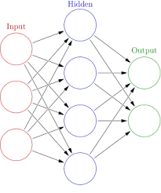

## `r emo::ji("keycap_1")`신경망이란

단층 퍼셉트론은 다음과 같은 수식으로 표현됩니다.

$$y = \begin{cases}0,(b+w_{1}x_{1} + w_{2}x_{2}\leq0)\\1,(b+w_{1}x_{1} + w_{2}x_{2}>0)\\\end{cases}$$

$z = b+w_{1}x_{1} + w_{2}x_{2}$로 나타낸다면 다음과 같이 나타낼 수 있습니다.

$$y = \begin{cases}0,z\leq0)\\1,z>0\\\end{cases}$$

즉, 입력신호의 가중합이 0을 넘으면 1을 반환하고 그렇지 않다면 0을 반환합니다. 이처럼 입력신호들의 값을 출력신호로 변환하는 함수를 활성화 함수라고 하며 단층 퍼셉트론에서 사용한 함수를 계단 함수라고 합니다.

단층 퍼셉트론은 활성화 함수로 계단 함수 사용하지만 신경망은 다른 활성화 함수를 사용할 수 있고 다층 퍼셉트론처럼 여러 층을 쌓아 만든 알고리즘이라 할 수 있습니다

{width="150"}

위 그림처럼 신경망은 크게 출력층(input layer), 은닉층(hidden layer), 출력층(output layer)로 이뤄져 있으며 각 원을 노드(node)라고 부릅니다.

##  `r emo::ji("keycap_2")`활성화 함수의 종류

### 계단함수

퍼셉트론에서 사용하는 함수. 출력는 0 또는 1이다.

$$h(z) = \begin{cases}0,z\leq0)\\1,z>0\\\end{cases}$$

### 시그모이드 함수

출력값의 범위가 0과 1사이에 존재한다.

$$h(z) = 1/(1+exp(-z))$$

### ReLU 함수

$$h(z) = \begin{cases}0,z\leq0)\\z,z>0\\\end{cases}$$

### 항등 함수

$$ h(z) = z$$

### 소프트맥스 함수

$h(z_k)$는 k번째 출력값을 의미

$$h(z_k) = exp(z_k)/\sum exp(z_i)$$

##  `r emo::ji("keycap_3")`비선형 함수

신경망에서 층을 쌓을 때 활성화 함수는 비선형 함수이어야 합니다. 만약 활성화 함수로 다음과 같은 함수를 사용한다면,

$$ h(z) = cz$$

층을 아무리 쌓아도 다음과 같은 형태로 단순화 시킬 수 있고 결국 층을 안쌓은 것과 동일한 효과를 갖게 됩니다.

$$ h(h(h(z))) = c^3z$$

그러므로 층을 쌓는 혜택을 얻기 위해서는 활성화 함수로 비선형 함수를 사용해야 합니다.

##  `r emo::ji("keycap_4")`numpy로 신경망 구현

이 글 처음에 등장한 그림은 3개의 입력을 받아 4개의 노드가 존재하는 은닉층 하나를 거쳐 2개를 출력하는 신경망을 도식화한 것입니다. numpy를 활용해 이를 구현해보겠습니다.

각 노드의 가중치는 임의로 넣고 은닉층의 활성화 함수는 시그모이드, 출력층의 활성화 함수는 항등함수를 사용했습니다.

```{python}
import numpy as np

def init_network():
    network = {}
    network["W1"] = np.array([[0.1,0.3,0.1,0.5],[0.2,0.4,0.3,0.4],[0.1,0.2,0.3,0.5]]) # 은닉층
    network["W2"] = np.array([[0.2,0.4],[0.1,0.2],[0.1,0.3],[0.5,0.5]]) # 출력층
    
    return network

def sigmoid(x):
    return 1/(1+np.exp(-x))

def identity_function(x):
    return x

def forward(network, x):
    W1, W2 = network["W1"], network["W2"]
    x = np.dot(x,W1)
    x = sigmoid(x)
    x = np.dot(x,W2)
    x = identity_function(x)
    
    return x

```

```{python}
network = init_network()
forward(network, np.array([0.1, 0.5, 0.7]))
```

##  `r emo::ji("keycap_5")`소프트맥스 함수의 특징

위 신경망에서 출력층은 항등함수로 구현된 것을 볼 수 있습니다. 일반적으로 회귀에는 항등함수를, 분류에는 소프트맥스 함수를 사용합니다. 그 이유는 소프트맥스의 출력값들의 합은 1이어서 각 출력값들을 분류확률로 해석할 수 있기 때문입니다. 그러므로 소프트맥스의 출력값으로 cost를 계산할 수 있게 됩니다. 하지만 학습된 모델을 적용할 때는 출력층에 소프트맥스를 사용할 필요가 없습니다. 소프트맥스 함수는 단조증가 함수이고 cost를 계산할 필요가 없기 때문에 가장 큰 값을 그대로 분류하면 됩니다. 지수함수 계산에 드는 비용도 줄일 수 있습니다.

소프트맥스를 코드로 구현 시 오버플로 문제가 존재합니다. 이 문제를 해결하기 위해 다음과 같은 수식으로 소프트맥스 함수를 개선할 수 있습니다.

$$h(z_k) = exp(z_k)/\sum exp(z_i) \\ = Cexp(z_k)/C\sum exp(z_i) \\ = exp(z_k+log(C))/\sum exp(z_i+log(C)), \\ C = -max(z_i)$$ 즉, 소프트맥스의 입력값에 상수를 더해도 그 값의 차이가 없으므로 입력값들 중 최대값을 각 입력값에 빼주면 오버플로 문제를 해결할 수 있습니다.

##  `r emo::ji("keycap_6")`분류 신경망 구현

iris 데이터를 활용하여 Species를 분류하는 모델을 만들어 보겠습니다.

-   data load

```{r}
library(reticulate)
py$iris <- iris
```

```{python}
import pandas as pd
iris = pd.DataFrame(iris)
```

```{python}
iris
```

-   one-hot_encoding

```{python}
x_data = iris.drop(["Species"], axis=1)
x_data = x_data.values
y_data = pd.get_dummies(iris['Species'])
y_data
y_data = y_data.values
```

-   modeling

임의로 가중치를 부여하여 모델을 만듭니다. 이전 모델과 큰 차이는 없지만 입력 노드와 출력 노드가 하나씩 더 들어가있고 출력층의 활성화 함수가 소프트맥스 함수로 바뀌었습니다.

```{python}
def init_network():
    network = {}
    network["W1"] = np.array([[0.1,0.3,0.1,0.5],[0.2,0.4,0.3,0.4],[0.5,0.2,0.3,0.5],[0.7,0.5,0.2,0.5]]) # 은닉층
    network["W2"] = np.array([[0.5,0.9,0.1],[0.1,0.2,0.7],[0.2,0.5,0.5],[0.5,0.5,0.5]]) # 출력층
    
    return network

def sigmoid(x):
    return 1/(1+np.exp(-x))

def softmax(x):
    c = np.max(x)
    exp_x = np.exp(x-c)
    sum_exp_x = np.sum(exp_x)
    
    return exp_x/sum_exp_x

def forward(network, x):
    W1, W2 = network["W1"], network["W2"]
    x = np.dot(x,W1)
    x = sigmoid(x)
    x = np.dot(x,W2)
    x = softmax(x)
    
    return x

```

첫번째 입력값만 넣어 출력을 확인해보면 2번째 값의 분류확률이 가장 높은 것을 확인할 수 있습니다.

```{python}
network = init_network()
forward(network, x_data[0])
```

Accuacy를 확인해보면 33%인 것을 확인할 수 있습니다. 아직 학습과정을 통해 가중치를 최적화 하지 않았기 때문입니다.

```{python}
network = init_network()

count = 0
for i in range(len(x_data)):
    pred_p = forward(network, x_data[i])
    index_max = np.argmax(pred_p)
    
    if index_max == np.argmax(y_data[i]):
        count += 1

print("Accuacy: ", count/len(x_data))
```

##  `r emo::ji("keycap_7")`배치 처리

아까 구현했던 모델에서 입력값의 shape, 각 가중치의 shape, 출력값의 shape을 확인해보겠습니다.

```{python}
def forward(network, x):
    W1, W2 = network["W1"], network["W2"]
    print("input : ", x.shape)
    print("W1 : ", W1.shape)
    print("W2 : ", W2.shape)
    x = np.dot(x,W1)
    x = sigmoid(x)
    x = np.dot(x,W2)
    x = softmax(x)
    print("output : ", x.shape)
    return x

forward(network, x_data[0])

```

행렬의 곱 원리에 따라 (1x4)(4x4)(4x3)=(1x3)의 array가 출력되는 것을 알 수 있습니다. 여기서 만약 input을 (3x4)로 주게 된다면 output은 (3x3)array로 출력될 것입니다.

이처럼 입력데이터를 묶어서 계산할 수 있으며 입력 데이터 묶음을 배치라고 하고 배치 안에 데이터의 수를 배치 크기(batch size)라고 합니다. 그럼 배치 처리를 구현해보겠습니다.

이전 코드와 다른 점은 소프트맥스 함수가 배치처리를 할 수 있도록 수정했고 예측을 수행할 때도 배치 별로 예측할 수 있도록 했습니다.

```{python}
def init_network():
    network = {}
    network["W1"] = np.array([[0.1,0.3,0.1,0.5],[0.2,0.4,0.3,0.4],[0.5,0.2,0.3,0.5],[0.7,0.5,0.2,0.5]]) # 은닉층
    network["W2"] = np.array([[0.5,0.9,0.1],[0.1,0.2,0.7],[0.2,0.5,0.5],[0.5,0.5,0.5]]) # 출력층
    
    return network

def sigmoid(x):
    return 1/(1+np.exp(-x))

def softmax(x):
    c = np.max(x)
    exp_x = np.exp(x-c)
    
    return np.multiply(exp_x.T, 1/np.sum(exp_x, axis=1)).T

def forward(network, x):
    W1, W2 = network["W1"], network["W2"]
    x = np.dot(x,W1)
    x = sigmoid(x)
    x = np.dot(x,W2)
    x = softmax(x)
    
    return x

network = init_network()
batch_size = 10

count = 0
for i in range(0, len(x_data), batch_size):
    x_batch = x_data[i:i+batch_size]
    pred_p = forward(network, x_batch)
    count += (np.argmax(pred_p, axis=1) == np.argmax(y_data[i:i+batch_size], axis=1)).sum()
    
print("Accuacy: ", count/len(x_data))
```

배치 처리는 컴퓨터로 계산할 때 큰 이점을 줍니다. 배치처리를 하지 않았을 때는 for문 루프가 데이터 수만큼 돌았지만 배치크기를 10개로 했을 때에는 10분의 1만큼 감소했습니다. 즉, 더 큰 배열로 한번에 계산하는 것이 컴퓨터는 더 빠릅니다.

다음장은 신경망 학습과정을 통해 가중치를 최적화하는 방법입니다. 위 모델도 학습과정을 통해 Accuacy를 높일 수 있습니다!
