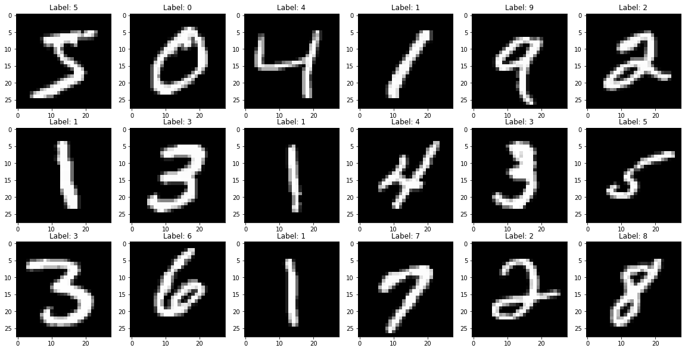
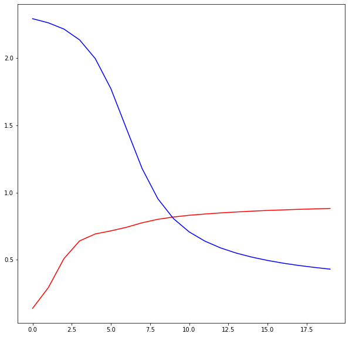
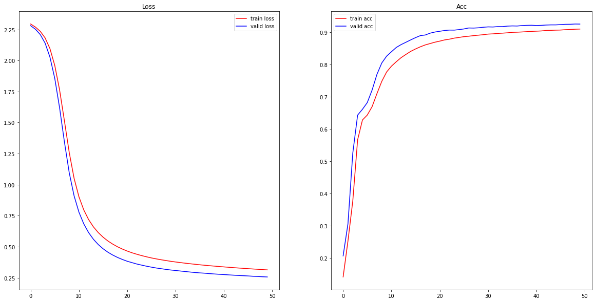
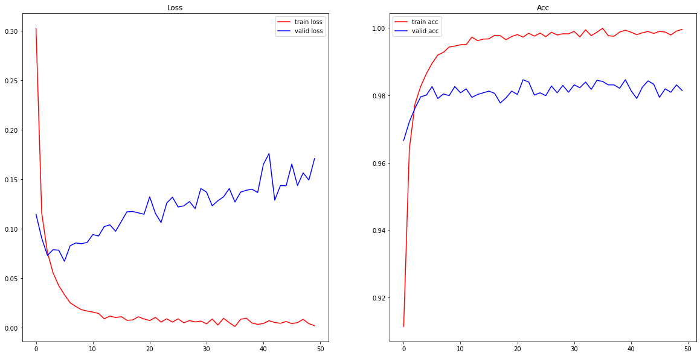
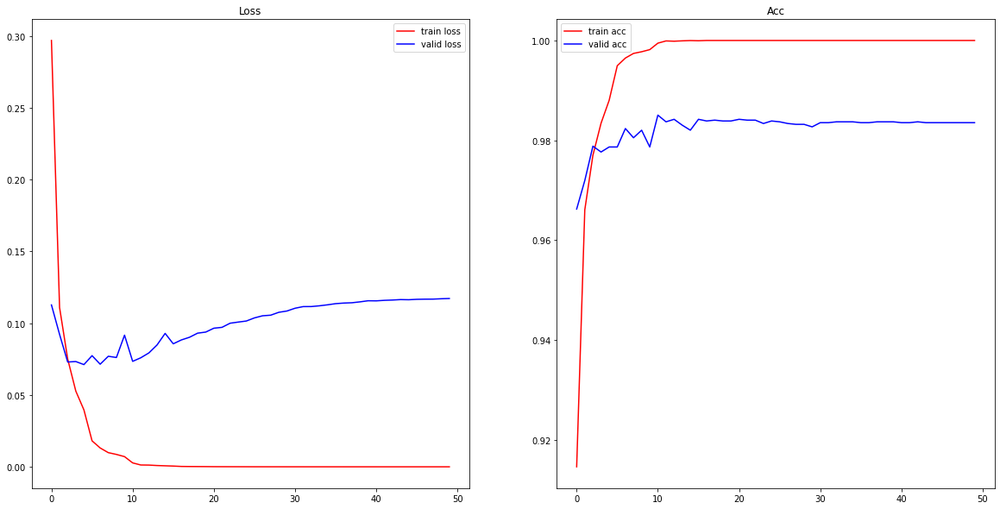
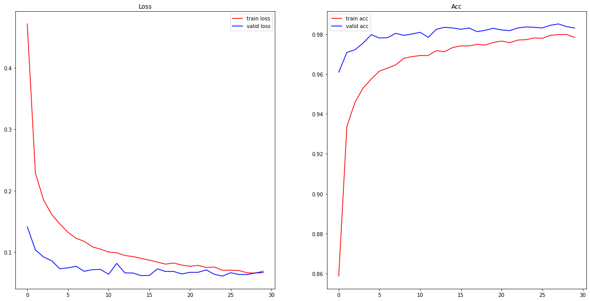
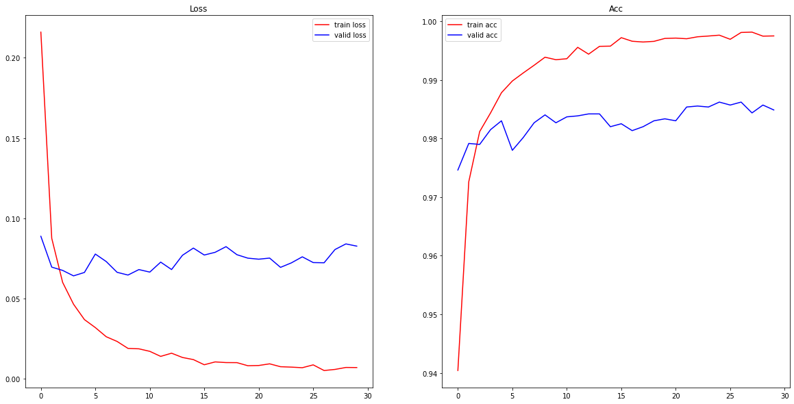
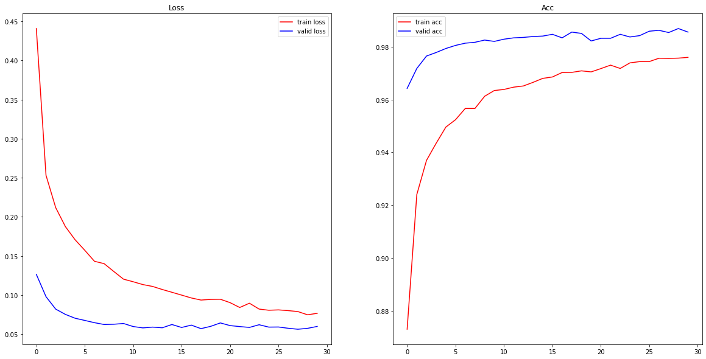

socar 부트캠프의 강의 중 일부를 정리한 내용입니다.

torch를 이용하여 MLP 모델을 구현했습니다. 또한 여러 종류의 optimizer, lr scheduler, regularization, dropout, batch normalization을 사용해보고 어떤 효과가 있는지 실험을 하며 비교해봤습니다. 

```python 
import os 
 
import torch 
from torch import nn 
from torch.utils.data import Dataset, DataLoader 
from torchvision import datasets, transforms 
 
import matplotlib.pyplot as plt 
``` 
 
gpu가 없지만 있다고 가정하고 구현했습니다. 
 
 
```python 
device = "cuda" if torch.cuda.is_available() else "cpu" 
device 
``` 
 
 
 
 
    'cpu' 
 
 
 
## Mnist 데이터 로드 
 
datasets.MNIST()을 이용하여 mnist 데이터를 저장 후 로드합니다. root에 이미 저장이 되있다면 로드만 됩니다. 
 
 
```python 
# 저장될 데이터 위치 지정 
root = os.path.join(os.getcwd(), "data") 
root 
``` 
 
 
 
 
    '/home/nackta/python_project/socar_bootcamp/data' 
 
 
 
 
```python 
mnist_train = datasets.MNIST( 
    root=root,  
    train=True,  
    download=True,  
    transform=transforms.ToTensor() 
) 
mnist_test = datasets.MNIST( 
    root=root,  
    train=False,  
    download=True,  
    transform=transforms.ToTensor() 
)  
``` 
 
mnist train 데이터는 60000개, test 데이터는 10000개임을 알 수 있습니다. 
 
 
```python 
print(mnist_train) 
print(mnist_test) 
``` 
 
    Dataset MNIST 
        Number of datapoints: 60000 
        Root location: /home/nackta/python_project/socar_bootcamp/data 
        Split: Train 
        StandardTransform 
    Transform: ToTensor() 
    Dataset MNIST 
        Number of datapoints: 10000 
        Root location: /home/nackta/python_project/socar_bootcamp/data 
        Split: Test 
        StandardTransform 
    Transform: ToTensor() 
 
 
mnist data에는 feature data와 label data가 tuple로 한 쌍으로 묶여져 있습니다. 
 
feature의 데이터 하나당 size는 (1x28x28)임을 알 수 있으며 매칭되는 label data로 정수가 있습니다.  
 
 
```python 
sample_x, sample_y = mnist_train[0] 
print(sample_x.shape) 
print(sample_y) 
``` 
 
    torch.Size([1, 28, 28]) 
    5 
 
 
라벨 데이터의 범위는 0~9까지의 정수입니다. 
 
 
```python 
mnist_train.targets.unique() 
``` 
 
 
 
 
    tensor([0, 1, 2, 3, 4, 5, 6, 7, 8, 9]) 
 
 
 
 
```python 
def plot_mnist(data, figsize=(20, 10)): 
    fig = plt.figure(figsize=figsize) 
    for i in range(18): 
        img = data[i][0] 
        ax = fig.add_subplot(3, 6, i+1) # 3x6, i+1번째 자리에 plot 
        ax.imshow(img.reshape(28, 28), cmap="gray") 
        ax.set_title(f"Label: {data[i][1]}") 
    fig.show() 
    pass 
``` 
 
 
```python 
plot_mnist(data=mnist_train) 
``` 
 
 
     
 
     
 
 
이처럼 mnist 데이터는 feature data로 손글씨 이미지가 있고 그에 맞게 label data가 있습니다.  
 
그럼 DataLoader를 통해 batch size를 64로 지정하겠습니다. drop_last=True이면 전체 데이터를 배치단위로 묶은 뒤 남은 데이터를 버리게 됩니다.  
 
 
```python 
train_loader = DataLoader(dataset=mnist_train, batch_size=64, shuffle=True, drop_last=True) 
test_loader = DataLoader(dataset=mnist_test, batch_size=64, shuffle=False, drop_last=True) 
``` 
 
각 배치의 shape은 64x1x28x28인 feature data와 64개의 label data로 이뤄져 있고 총 937의 배치가 만들어졌습니다.  
 
 
```python 
for i, batch in enumerate(train_loader): 
    x, y = batch 
    if i == 0: 
        print(x.shape) 
        print(y) 
print(i+1) 
``` 
 
    torch.Size([64, 1, 28, 28]) 
    tensor([0, 2, 0, 0, 1, 7, 3, 2, 4, 5, 8, 8, 4, 0, 9, 8, 3, 1, 3, 3, 5, 1, 4, 7, 
            0, 4, 8, 4, 9, 4, 3, 7, 9, 7, 6, 1, 3, 8, 7, 0, 5, 1, 1, 3, 3, 0, 6, 3, 
            2, 2, 2, 5, 4, 5, 5, 7, 3, 7, 8, 3, 0, 7, 9, 9]) 
    937 
 
 
 
```python 
len(train_loader) 
``` 
 
 
 
 
    937 
 
 
 
## 모델 구현 
 
기본적인 mlp 모델을 구현해보겠습니다. 2차원 input데이터를 Flatten()을 통해 1차원 행렬로 변환 후 2개의 은닉층을 거쳐 10개의 값을 출력하는 모델을 만듭니다.  
 
 
```python 
class LionMNISTClassifier(nn.Module): 
    def __init__(self, n_class=10): 
        super().__init__() 
 
        self.model = nn.Sequential( 
            nn.Flatten(), 
            nn.Linear(28 * 28, 256), 
            nn.ReLU(), 
            nn.Linear(256, 128), 
            nn.ReLU(), 
            nn.Linear(128, n_class), 
        ) 
 
    def forward(self, x): 
        return self.model(x) 
``` 
 
 
```python 
mlp = LionMNISTClassifier().to(device) # 모델을 gpu에서 계산할 수 있도록 지정 
mlp 
``` 
 
 
 
 
    LionMNISTClassifier( 
      (model): Sequential( 
        (0): Flatten(start_dim=1, end_dim=-1) 
        (1): Linear(in_features=784, out_features=256, bias=True) 
        (2): ReLU() 
        (3): Linear(in_features=256, out_features=128, bias=True) 
        (4): ReLU() 
        (5): Linear(in_features=128, out_features=10, bias=True) 
      ) 
    ) 
 
 
 
loss 함수는 CrossEntropy, optimizer는 SGD, learning rate는 0.001을 사용합니다 
 
 
```python 
loss_fn = nn.CrossEntropyLoss() 
optim = torch.optim.SGD(mlp.parameters(), lr=0.001) 
``` 
 
## Train 
 
train 과정에서 가장 핵심인 부분은 loss.backward(), optim.step(), optim.zero_grad()로 이어지는 3단계입니다. 
 
- loss.backward() 
 
계산된 loss 텐서에 .backward()를 실행하면 역전파가 실행됩니다. loss 안에 pred의 각 parameters에 대한 변화도를 계산하고 저장합니다. 
 
- optim.step() 
 
저장된 변화도에 따라 각 parameters를 조정합니다. 
 
- optim.zero_grad() 
 
각 parameters에 저장된 변화도를 0으로 초기화합니다. 초기화하지 않으면 변화도가 누적되어 계산됩니다. 
 
 
```python 
num_epochs = 20 
train_history = {"loss": [], "acc": []} 
for e in range(num_epochs): 
    print(f"Epoch: {e} start.") 
    epoch_loss, epoch_acc = 0, 0 
    size = len(train_loader.dataset) 
    for b, (x, y) in enumerate(train_loader): 
        x.to(device) 
        y.to(device) 
 
        pred = mlp(x) 
        loss = loss_fn(pred, y) 
 
        optim.zero_grad() # parameters의 변화량을 0으로 초기화 
        loss.backward() # 에러의 변화도를 계산하여 저장 
        optim.step() # loss를 최소화 할 수 있도록 parameters 수정 
 
        loss = loss.to("cpu").item() 
        acc = (pred.argmax(1) == y).type(torch.float).to("cpu").mean().item() 
 
        if b % 200 == 0: 
            print(f"loss: {loss:>7f}, acc: {acc:>4f} [{b * len(x)}/{size}]") 
 
        epoch_loss += loss 
        epoch_acc += acc 
 
    train_history["loss"].append(epoch_loss / len(train_loader)) 
    train_history["acc"].append(epoch_acc / len(train_loader)) 
``` 
 
    Epoch: 0 start. 
    loss: 2.306067, acc: 0.093750 [0/60000] 
    loss: 2.307073, acc: 0.046875 [12800/60000] 
    loss: 2.293016, acc: 0.109375 [25600/60000] 
    loss: 2.285884, acc: 0.140625 [38400/60000] 
    loss: 2.294895, acc: 0.156250 [51200/60000] 
    Epoch: 1 start. 
    loss: 2.277667, acc: 0.218750 [0/60000] 
    loss: 2.266313, acc: 0.250000 [12800/60000] 
    loss: 2.267338, acc: 0.250000 [25600/60000] 
    loss: 2.254096, acc: 0.296875 [38400/60000] 
    loss: 2.242105, acc: 0.453125 [51200/60000] 
    Epoch: 2 start. 
    loss: 2.255541, acc: 0.390625 [0/60000] 
    loss: 2.236494, acc: 0.484375 [12800/60000] 
    loss: 2.213965, acc: 0.500000 [25600/60000] 
    loss: 2.202532, acc: 0.593750 [38400/60000] 
    loss: 2.200587, acc: 0.437500 [51200/60000] 
    Epoch: 3 start. 
    loss: 2.181767, acc: 0.578125 [0/60000] 
    loss: 2.161530, acc: 0.640625 [12800/60000] 
    loss: 2.147703, acc: 0.625000 [25600/60000] 
    loss: 2.144805, acc: 0.593750 [38400/60000] 
    loss: 2.088173, acc: 0.656250 [51200/60000] 
    Epoch: 4 start. 
    loss: 2.067614, acc: 0.671875 [0/60000] 
    loss: 2.047233, acc: 0.671875 [12800/60000] 
    loss: 2.004169, acc: 0.718750 [25600/60000] 
    loss: 1.925291, acc: 0.750000 [38400/60000] 
    loss: 1.996897, acc: 0.593750 [51200/60000] 
    Epoch: 5 start. 
    loss: 1.886086, acc: 0.703125 [0/60000] 
    loss: 1.824186, acc: 0.718750 [12800/60000] 
    loss: 1.785833, acc: 0.750000 [25600/60000] 
    loss: 1.820181, acc: 0.593750 [38400/60000] 
    loss: 1.707675, acc: 0.734375 [51200/60000] 
    Epoch: 6 start. 
    loss: 1.637798, acc: 0.703125 [0/60000] 
    loss: 1.547363, acc: 0.656250 [12800/60000] 
    loss: 1.555369, acc: 0.734375 [25600/60000] 
    loss: 1.479918, acc: 0.781250 [38400/60000] 
    loss: 1.312469, acc: 0.796875 [51200/60000] 
    Epoch: 7 start. 
    loss: 1.329046, acc: 0.718750 [0/60000] 
    loss: 1.342677, acc: 0.765625 [12800/60000] 
    loss: 1.278799, acc: 0.765625 [25600/60000] 
    loss: 1.217570, acc: 0.734375 [38400/60000] 
    loss: 1.073273, acc: 0.781250 [51200/60000] 
    Epoch: 8 start. 
    loss: 1.050970, acc: 0.765625 [0/60000] 
    loss: 0.996948, acc: 0.718750 [12800/60000] 
    loss: 0.857504, acc: 0.843750 [25600/60000] 
    loss: 0.988426, acc: 0.750000 [38400/60000] 
    loss: 0.861934, acc: 0.812500 [51200/60000] 
    Epoch: 9 start. 
    loss: 0.766343, acc: 0.875000 [0/60000] 
    loss: 0.836710, acc: 0.812500 [12800/60000] 
    loss: 0.742993, acc: 0.828125 [25600/60000] 
    loss: 0.921689, acc: 0.765625 [38400/60000] 
    loss: 0.722942, acc: 0.843750 [51200/60000] 
    Epoch: 10 start. 
    loss: 0.701428, acc: 0.843750 [0/60000] 
    loss: 0.671582, acc: 0.875000 [12800/60000] 
    loss: 0.853458, acc: 0.765625 [25600/60000] 
    loss: 0.622920, acc: 0.875000 [38400/60000] 
    loss: 0.490978, acc: 0.937500 [51200/60000] 
    Epoch: 11 start. 
    loss: 0.700725, acc: 0.750000 [0/60000] 
    loss: 0.636329, acc: 0.875000 [12800/60000] 
    loss: 0.546823, acc: 0.875000 [25600/60000] 
    loss: 0.531841, acc: 0.875000 [38400/60000] 
    loss: 0.744622, acc: 0.828125 [51200/60000] 
    Epoch: 12 start. 
    loss: 0.895801, acc: 0.718750 [0/60000] 
    loss: 0.559750, acc: 0.828125 [12800/60000] 
    loss: 0.458211, acc: 0.921875 [25600/60000] 
    loss: 0.624367, acc: 0.859375 [38400/60000] 
    loss: 0.529751, acc: 0.890625 [51200/60000] 
    Epoch: 13 start. 
    loss: 0.457774, acc: 0.828125 [0/60000] 
    loss: 0.428744, acc: 0.890625 [12800/60000] 
    loss: 0.594997, acc: 0.843750 [25600/60000] 
    loss: 0.552424, acc: 0.859375 [38400/60000] 
    loss: 0.562785, acc: 0.890625 [51200/60000] 
    Epoch: 14 start. 
    loss: 0.538646, acc: 0.843750 [0/60000] 
    loss: 0.445669, acc: 0.875000 [12800/60000] 
    loss: 0.538240, acc: 0.890625 [25600/60000] 
    loss: 0.518024, acc: 0.890625 [38400/60000] 
    loss: 0.471751, acc: 0.875000 [51200/60000] 
    Epoch: 15 start. 
    loss: 0.483013, acc: 0.828125 [0/60000] 
    loss: 0.470244, acc: 0.890625 [12800/60000] 
    loss: 0.593319, acc: 0.828125 [25600/60000] 
    loss: 0.383731, acc: 0.937500 [38400/60000] 
    loss: 0.705848, acc: 0.812500 [51200/60000] 
    Epoch: 16 start. 
    loss: 0.380595, acc: 0.906250 [0/60000] 
    loss: 0.301426, acc: 0.921875 [12800/60000] 
    loss: 0.450054, acc: 0.921875 [25600/60000] 
    loss: 0.438868, acc: 0.875000 [38400/60000] 
    loss: 0.573046, acc: 0.843750 [51200/60000] 
    Epoch: 17 start. 
    loss: 0.500203, acc: 0.875000 [0/60000] 
    loss: 0.595378, acc: 0.812500 [12800/60000] 
    loss: 0.625601, acc: 0.843750 [25600/60000] 
    loss: 0.523467, acc: 0.828125 [38400/60000] 
    loss: 0.544994, acc: 0.859375 [51200/60000] 
    Epoch: 18 start. 
    loss: 0.590928, acc: 0.875000 [0/60000] 
    loss: 0.597640, acc: 0.890625 [12800/60000] 
    loss: 0.659121, acc: 0.781250 [25600/60000] 
    loss: 0.361116, acc: 0.906250 [38400/60000] 
    loss: 0.741920, acc: 0.843750 [51200/60000] 
    Epoch: 19 start. 
    loss: 0.407344, acc: 0.875000 [0/60000] 
    loss: 0.564885, acc: 0.843750 [12800/60000] 
    loss: 0.557660, acc: 0.796875 [25600/60000] 
    loss: 0.335187, acc: 0.921875 [38400/60000] 
    loss: 0.486878, acc: 0.812500 [51200/60000] 
 
 
훈련이 진행될수록 loss는 감소하고 정확도는 증가했습니다. 
 
 
```python 
fig = plt.figure(figsize=(10, 10)) 
ax = fig.add_subplot(1, 1, 1) 
ax.plot(train_history["acc"], color="red", label="acc") 
ax.plot(train_history["loss"], color="blue", label="loss") 
fig.show() 
``` 
 
 
     
 
     
 
 
## Test 
 
train을 통해 최적화된 model로 test data를 예측합니다. 여기서 with torch.no_grad()문 안에서 실행되는 pytorch는 autograd engine 기능을 중단합니다. 이를 통해 모델의 parameters가 변화하는 것을 방지 할 수 있고 메모리 사용량을 줄이고 연산속도을 높일 수 있습니다. 
 
 
```python 
print("Test start.") 
test_loss, test_acc = 0, 0 
size = len(test_loader.dataset) 
 
with torch.no_grad(): 
    for b, (x, y) in enumerate(test_loader): 
        x.to(device) 
        y.to(device) 
 
        pred = mlp(x) 
        test_loss += loss_fn(pred, y).to("cpu").item() 
        test_acc += (pred.argmax(1) == y).type(torch.float).to("cpu").mean().item() 
 
    test_loss /= len(test_loader) 
    test_acc /= len(test_loader) 
 
print(f"test loss: {test_loss:>7f}, test_acc: {test_acc:>4f}.") 
``` 
 
    Test start. 
    test loss: 0.409632, test_acc: 0.886719. 
 
 
지금까지는 각 노드의 parameters를 최적화하여 모델의 성능을 높였습니다. 하지만 모델의 성능을 높이기 위해 optimizer, lr scheduler, regularization, dropout과 batch normalization 등을 적용할 수 있습니다.  
 
## split train vaild 
 
 
```python 
class mnist_dataset(Dataset): 
    def __init__(self, data, targets, transform=None, target_transform=None): 
        super().__init__() 
 
        self.data = data 
        self.targets = targets 
        self.transform = transform 
        self.target_transform = target_transform 
        pass 
 
    def __len__(self): 
        return len(self.data) 
 
    def __getitem__(self, idx): 
        x, y = self.data[idx], self.targets[idx] 
 
        if self.transform: 
            x = self.transform(x) 
        if self.target_transform: 
            y = self.target_transform(y) 
 
        return x, y 
 
def split_train_valid(dataset, valid_ratio=0.1): 
    n_valid = int(len(dataset) * valid_ratio) 
     
    train_data = dataset.data[:-n_valid].numpy() 
    valid_data = dataset.data[-n_valid:].numpy() 
    train_targets = dataset.targets[:-n_valid] 
    valid_targets = dataset.targets[-n_valid:] 
 
    train = mnist_dataset(data=train_data, targets=train_targets, transform=dataset.transform, target_transform=dataset.target_transform) 
    valid = mnist_dataset(data=valid_data, targets=valid_targets, transform=dataset.transform, target_transform=dataset.target_transform) 
 
    return train, valid 
``` 
 
 
```python 
mnist_train, mnist_valid = split_train_valid(dataset=mnist_train) 
``` 
 
 
```python 
train_loader = DataLoader(dataset=mnist_train, batch_size= 64, shuffle = True, drop_last=True) 
valid_loader = DataLoader(dataset=mnist_valid, batch_size= 64, shuffle = False, drop_last=True) 
test_loader = DataLoader(dataset=mnist_test, batch_size= 64, shuffle = False, drop_last=True) 
 
loaders = { 
    'train' : train_loader, 
    'valid' : valid_loader, 
    'test' : test_loader 
} 
``` 
 
## Trainer class 구현 
 
### _ _ init _ _ () 
model, train/valid/test로 나눠진 dataloder, optimizer 함수, learning rate,  learning rate scheduler 사용 여부를 받아서 정의합니다. 
 
###  _get_optimizer() 
optimizer 함수를 정의합니다. 
 
### _get_scheduler() 
learning rate scheduler를 정의합니다. StepLR()는 일정한 Step 마다 learning rate에 gamma를 곱해주는 방식입니다. 
 
### train() 
epoch 마다 훈련과 검증을 실시하고 loss와 accuracy를 저장합니다. 
 
 
```python 
class Trainer(nn.Module): 
    def __init__(self, model_class, loaders, n_class=10, opt="sgd", lr=0.001, has_scheduler=False, device="cpu"): 
        super().__init__() 
 
        self.model = model_class(n_class=n_class) 
        self.loss = nn.CrossEntropyLoss() 
 
        self.train_loader = loaders["train"] 
        self.valid_loader = loaders["valid"] 
        self.test_loader = loaders["test"] 
 
        self._get_optimizer(opt=opt.lower(), lr=lr) 
        self.has_scheduler = has_scheduler 
        if self.has_scheduler: 
            self._get_scheduler() 
 
        self.device = device 
        pass 
 
    def _get_optimizer(self, opt, lr=0.001): 
        if opt == "sgd": 
            self.optimizer = torch.optim.SGD( 
                params=self.model.parameters(), lr=lr) 
        elif opt == "adam": 
            self.optimizer = torch.optim.Adam( 
                params=self.model.parameters(), lr=lr) 
        else: 
            raise ValueError(f"optimizer {opt} is not supproted") 
 
    def _get_scheduler(self): 
        self.scheduler = torch.optim.lr_scheduler.StepLR( 
            optimizer=self.optimizer, step_size=5, gamma=0.5, verbose=True) 
 
    def train(self, max_epochs=10): 
        print("===== Train Start =====") 
        history = {"train_loss": [], "train_acc": [], 
                   "valid_loss": [], "valid_acc": []} 
        for e in range(max_epochs): 
            train_loss, train_acc = self._train_epoch() 
            valid_loss, valid_acc = self._valid_epoch() 
 
            history["train_loss"].append(train_loss) 
            history["train_acc"].append(train_acc) 
            history["valid_loss"].append(valid_loss) 
            history["valid_acc"].append(valid_acc) 
 
            if self.has_scheduler: 
                self.scheduler.step() 
 
            if e % 5 == 0: 
                print( 
                    f"Epoch: {e}, train loss: {train_loss:>6f}, train acc: {train_acc:>3f}, valid loss: {valid_loss:>6f}, valid acc: {valid_acc:>3f}") 
 
        self.plot_history(history) 
 
    def _train_epoch(self): 
        epoch_loss, epoch_acc = 0, 0 
        self.model.train() 
        for (x, y) in self.train_loader: 
            x = x.to(self.device) 
            y = y.to(self.device) 
 
            y_hat = self.model(x) 
            loss = self.loss(y_hat, y) 
 
            self.optimizer.zero_grad() 
            loss.backward() 
            self.optimizer.step() 
 
            epoch_loss += loss.to("cpu").item() 
            epoch_acc += (y_hat.argmax(1) == 
                          y).type(torch.float).to("cpu").mean().item() 
 
        epoch_loss /= len(self.train_loader) 
        epoch_acc /= len(self.train_loader) 
 
        return epoch_loss, epoch_acc 
 
    def _valid_epoch(self): 
        epoch_loss, epoch_acc = 0, 0 
        self.model.eval() 
        with torch.no_grad(): 
            for (x, y) in self.valid_loader: 
                x = x.to(self.device) 
                y = y.to(self.device) 
 
                y_hat = self.model(x) 
                loss = self.loss(y_hat, y) 
 
                epoch_loss += loss.to("cpu").item() 
                epoch_acc += (y_hat.argmax(1) == 
                              y).type(torch.float).to("cpu").mean().item() 
 
        epoch_loss /= len(self.valid_loader) 
        epoch_acc /= len(self.valid_loader) 
 
        return epoch_loss, epoch_acc 
 
    def plot_history(self, history): 
        fig = plt.figure(figsize=(20, 10)) 
 
        ax = fig.add_subplot(1, 2, 1) 
        ax.plot(history["train_loss"], color="red", label="train loss") 
        ax.plot(history["valid_loss"], color="blue", label="valid loss") 
        ax.set_title("Loss") 
        ax.legend() 
 
        ax = fig.add_subplot(1, 2, 2) 
        ax.plot(history["train_acc"], color="red", label="train acc") 
        ax.plot(history["valid_acc"], color="blue", label="valid acc") 
        ax.set_title("Acc") 
        ax.legend() 
 
        fig.show() 
 
    def test(self): 
        print("===== Test Start =====") 
        epoch_loss, epoch_acc = 0, 0 
        self.model.eval() 
        with torch.no_grad(): 
            for (x, y) in self.test_loader: 
                x = x.to(self.device) 
                y = y.to(self.device) 
 
                y_hat = self.model(x) 
                loss = self.loss(y_hat, y) 
 
                epoch_loss += loss.to("cpu").item() 
                epoch_acc += (y_hat.argmax(1) == 
                              y).type(torch.float).to("cpu").mean().item() 
 
        epoch_loss /= len(self.test_loader) 
        epoch_acc /= len(self.test_loader) 
 
        print(f"Test loss: {epoch_loss:>6f}, Test acc: {epoch_acc:>3f}") 
 
``` 
 
## opimizer 비교 (sgd, adam) 
 
### SGD 
 
 
```python 
trainer = Trainer(model_class=LionMNISTClassifier, loaders=loaders, n_class=10, opt="sgd", lr=0.001, device=device).to(device) 
trainer.train(max_epochs=50) 
trainer.test() 
``` 
 
    ===== Train Start ===== 
    Epoch: 0, train loss: 2.293853, train acc: 0.140866, valid loss: 2.280568, valid acc: 0.206149 
    Epoch: 5, train loss: 1.959832, train acc: 0.643127, valid loss: 1.855423, valid acc: 0.681788 
    Epoch: 10, train loss: 0.902655, train acc: 0.794799, valid loss: 0.778864, valid acc: 0.839550 
    Epoch: 15, train loss: 0.577160, train acc: 0.848291, valid loss: 0.483942, valid acc: 0.883401 
    Epoch: 20, train loss: 0.465347, train acc: 0.872461, valid loss: 0.383265, valid acc: 0.903058 
    Epoch: 25, train loss: 0.410083, train acc: 0.886343, valid loss: 0.335912, valid acc: 0.910282 
    Epoch: 30, train loss: 0.377565, train acc: 0.894276, valid loss: 0.308982, valid acc: 0.916667 
    Epoch: 35, train loss: 0.354993, train acc: 0.899726, valid loss: 0.289612, valid acc: 0.919691 
    Epoch: 40, train loss: 0.337928, train acc: 0.903321, valid loss: 0.276297, valid acc: 0.920867 
    Epoch: 45, train loss: 0.323637, train acc: 0.906880, valid loss: 0.265034, valid acc: 0.923723 
    ===== Test Start ===== 
    Test loss: 0.295112, Test acc: 0.914764 
 
 
 
     
 
     
 
 
### adam 
 
 
```python 
trainer = Trainer(model_class=LionMNISTClassifier, loaders=loaders, n_class=10, opt="adam", lr=0.001, device=device).to(device) 
trainer.train(max_epochs=50) 
trainer.test() 
``` 
 
    ===== Train Start ===== 
    Epoch: 0, train loss: 0.302497, train acc: 0.911477, valid loss: 0.114387, valid acc: 0.966566 
    Epoch: 5, train loss: 0.033073, train acc: 0.989417, valid loss: 0.066883, valid acc: 0.982527 
    Epoch: 10, train loss: 0.015452, train acc: 0.994921, valid loss: 0.093913, valid acc: 0.980679 
    Epoch: 15, train loss: 0.010835, train acc: 0.996664, valid loss: 0.107089, valid acc: 0.981183 
    Epoch: 20, train loss: 0.006893, train acc: 0.997924, valid loss: 0.132105, valid acc: 0.980175 
    Epoch: 25, train loss: 0.008649, train acc: 0.997294, valid loss: 0.121791, valid acc: 0.979839 
    Epoch: 30, train loss: 0.003595, train acc: 0.998869, valid loss: 0.136822, valid acc: 0.983031 
    Epoch: 35, train loss: 0.000891, train acc: 0.999778, valid loss: 0.126824, valid acc: 0.984039 
    Epoch: 40, train loss: 0.003926, train acc: 0.998647, valid loss: 0.164973, valid acc: 0.981351 
    Epoch: 45, train loss: 0.003763, train acc: 0.998869, valid loss: 0.165165, valid acc: 0.979335 
    ===== Test Start ===== 
    Test loss: 0.142515, Test acc: 0.980869 
 
 
 
     
 
     
 
 
그래프를 비교해보면 adam이 sgd보다 더 빠르게 accuracy=1에 가까워지고 있음을 알 수 있습니다. 그래프 모양 또한 sgd는 부드러운 곡선을 그리지만 adam은 삐뚤삐뚤한 형태로 수렴하고 있습니다. adam이 더 높은 accuracy를 갖는 모델이지만 훈련시간 또한 긴 것을 확인할 수 있습니다. 
 
## learning rate scheduler 사용 유무 비교 
 
 
```python 
trainer = Trainer(model_class=LionMNISTClassifier, loaders=loaders, n_class=10, opt="adam", lr=0.001, has_scheduler=True, device=device).to(device) 
trainer.train(max_epochs=50) 
``` 
 
    Adjusting learning rate of group 0 to 1.0000e-03. 
    ===== Train Start ===== 
    Adjusting learning rate of group 0 to 1.0000e-03. 
    Epoch: 0, train loss: 0.296774, train acc: 0.914591, valid loss: 0.112701, valid acc: 0.966230 
    Adjusting learning rate of group 0 to 1.0000e-03. 
    Adjusting learning rate of group 0 to 1.0000e-03. 
    Adjusting learning rate of group 0 to 1.0000e-03. 
    Adjusting learning rate of group 0 to 5.0000e-04. 
    Adjusting learning rate of group 0 to 5.0000e-04. 
    Epoch: 5, train loss: 0.018088, train acc: 0.994940, valid loss: 0.077383, valid acc: 0.978663 
    Adjusting learning rate of group 0 to 5.0000e-04. 
    Adjusting learning rate of group 0 to 5.0000e-04. 
    Adjusting learning rate of group 0 to 5.0000e-04. 
    Adjusting learning rate of group 0 to 2.5000e-04. 
    Adjusting learning rate of group 0 to 2.5000e-04. 
    Epoch: 10, train loss: 0.002736, train acc: 0.999462, valid loss: 0.073415, valid acc: 0.985047 
    Adjusting learning rate of group 0 to 2.5000e-04. 
    Adjusting learning rate of group 0 to 2.5000e-04. 
    Adjusting learning rate of group 0 to 2.5000e-04. 
    Adjusting learning rate of group 0 to 1.2500e-04. 
    Adjusting learning rate of group 0 to 1.2500e-04. 
    Epoch: 15, train loss: 0.000520, train acc: 0.999944, valid loss: 0.085636, valid acc: 0.984207 
    Adjusting learning rate of group 0 to 1.2500e-04. 
    Adjusting learning rate of group 0 to 1.2500e-04. 
    Adjusting learning rate of group 0 to 1.2500e-04. 
    Adjusting learning rate of group 0 to 6.2500e-05. 
    Adjusting learning rate of group 0 to 6.2500e-05. 
    Epoch: 20, train loss: 0.000101, train acc: 1.000000, valid loss: 0.096484, valid acc: 0.984207 
    Adjusting learning rate of group 0 to 6.2500e-05. 
    Adjusting learning rate of group 0 to 6.2500e-05. 
    Adjusting learning rate of group 0 to 6.2500e-05. 
    Adjusting learning rate of group 0 to 3.1250e-05. 
    Adjusting learning rate of group 0 to 3.1250e-05. 
    Epoch: 25, train loss: 0.000039, train acc: 1.000000, valid loss: 0.103663, valid acc: 0.983703 
    Adjusting learning rate of group 0 to 3.1250e-05. 
    Adjusting learning rate of group 0 to 3.1250e-05. 
    Adjusting learning rate of group 0 to 3.1250e-05. 
    Adjusting learning rate of group 0 to 1.5625e-05. 
    Adjusting learning rate of group 0 to 1.5625e-05. 
    Epoch: 30, train loss: 0.000020, train acc: 1.000000, valid loss: 0.110385, valid acc: 0.983535 
    Adjusting learning rate of group 0 to 1.5625e-05. 
    Adjusting learning rate of group 0 to 1.5625e-05. 
    Adjusting learning rate of group 0 to 1.5625e-05. 
    Adjusting learning rate of group 0 to 7.8125e-06. 
    Adjusting learning rate of group 0 to 7.8125e-06. 
    Epoch: 35, train loss: 0.000013, train acc: 1.000000, valid loss: 0.113576, valid acc: 0.983535 
    Adjusting learning rate of group 0 to 7.8125e-06. 
    Adjusting learning rate of group 0 to 7.8125e-06. 
    Adjusting learning rate of group 0 to 7.8125e-06. 
    Adjusting learning rate of group 0 to 3.9063e-06. 
    Adjusting learning rate of group 0 to 3.9063e-06. 
    Epoch: 40, train loss: 0.000010, train acc: 1.000000, valid loss: 0.115529, valid acc: 0.983535 
    Adjusting learning rate of group 0 to 3.9063e-06. 
    Adjusting learning rate of group 0 to 3.9063e-06. 
    Adjusting learning rate of group 0 to 3.9063e-06. 
    Adjusting learning rate of group 0 to 1.9531e-06. 
    Adjusting learning rate of group 0 to 1.9531e-06. 
    Epoch: 45, train loss: 0.000009, train acc: 1.000000, valid loss: 0.116594, valid acc: 0.983535 
    Adjusting learning rate of group 0 to 1.9531e-06. 
    Adjusting learning rate of group 0 to 1.9531e-06. 
    Adjusting learning rate of group 0 to 1.9531e-06. 
    Adjusting learning rate of group 0 to 9.7656e-07. 
 
 
 
     
 
     
 
 
 
```python 
trainer.test() 
``` 
 
    ===== Test Start ===== 
    Test loss: 0.102079, Test acc: 0.983574 
 
 
learning rate scheduler를 사용한 결과 accuracy의 소폭 향상이 있었습니다. 훈련 과정을 보면 점점 learning rate가 줄어들면서 학습이 진행되는 것을 볼 수 있습니다. 
 
##  dropout, batch normalization 
 
dropout과 batch normalization을 적용하는 방법은 각 layer에 nn.Dropout(), nn.BatchNorm1d()을 넣어주면 됩니다. 모두 accuracy가 소폭 향상한 것을 알 수 있습니다. 
 
 
```python 
class LionMNISTDropoutClassifier(nn.Module): 
    def __init__(self, n_class=10): 
        super().__init__() 
 
        self.model = nn.Sequential( 
            nn.Flatten(), 
            nn.Linear(28 * 28, 256), 
            nn.Dropout(p=0.5), 
            nn.ReLU(), 
            nn.Linear(256, 128), 
            nn.Dropout(p=0.5), 
            nn.ReLU(), 
            nn.Linear(128, n_class), 
        ) 
 
    def forward(self, x): 
        return self.model(x) 
 
 
class LionMNISTBNClassifier(nn.Module): 
    def __init__(self, n_class=10): 
        super().__init__() 
 
        self.model = nn.Sequential( 
            nn.Flatten(), 
            nn.Linear(28 * 28, 256), 
            nn.BatchNorm1d(256), 
            nn.ReLU(), 
            nn.Linear(256, 128), 
            nn.BatchNorm1d(128), 
            nn.ReLU(), 
            nn.Linear(128, n_class), 
        ) 
 
    def forward(self, x): 
        return self.model(x) 
 
 
class LionMNISTDropoutBNClassifier(nn.Module): 
    def __init__(self, n_class=10): 
        super().__init__() 
 
        self.model = nn.Sequential( 
            nn.Flatten(), 
            nn.Linear(28 * 28, 256), 
            nn.BatchNorm1d(256), 
            nn.Dropout(p=0.5), 
            nn.ReLU(), 
            nn.Linear(256, 128), 
            nn.BatchNorm1d(128), 
            nn.Dropout(p=0.5), 
            nn.ReLU(), 
            nn.Linear(128, n_class), 
        ) 
 
    def forward(self, x): 
        return self.model(x) 
 
``` 
 
 
```python 
trainer = Trainer(model_class=LionMNISTDropoutClassifier, loaders=loaders, n_class=10, opt="adam", lr=0.001, device=device).to(device) 
trainer.train(max_epochs=30) 
trainer.test() 
``` 
 
    ===== Train Start ===== 
    Epoch: 0, train loss: 0.471969, train acc: 0.858708, valid loss: 0.140879, valid acc: 0.960853 
    Epoch: 5, train loss: 0.131920, train acc: 0.961410, valid loss: 0.073890, valid acc: 0.977991 
    Epoch: 10, train loss: 0.099638, train acc: 0.969195, valid loss: 0.063448, valid acc: 0.980847 
    Epoch: 15, train loss: 0.086451, train acc: 0.974032, valid loss: 0.061495, valid acc: 0.982359 
    Epoch: 20, train loss: 0.076410, train acc: 0.976479, valid loss: 0.066648, valid acc: 0.982023 
    Epoch: 25, train loss: 0.070171, train acc: 0.977832, valid loss: 0.065918, valid acc: 0.983031 
    ===== Test Start ===== 
    Test loss: 0.073770, Test acc: 0.981671 
 
 
 
     
 
     
 
 
 
```python 
trainer = Trainer(model_class=LionMNISTBNClassifier, loaders=loaders, n_class=10, opt="adam", lr=0.001, device=device).to(device) 
trainer.train(max_epochs=30) 
trainer.test() 
``` 
 
    ===== Train Start ===== 
    Epoch: 0, train loss: 0.215938, train acc: 0.940410, valid loss: 0.088783, valid acc: 0.974630 
    Epoch: 5, train loss: 0.031933, train acc: 0.989824, valid loss: 0.077726, valid acc: 0.977991 
    Epoch: 10, train loss: 0.017131, train acc: 0.993624, valid loss: 0.066482, valid acc: 0.983703 
    Epoch: 15, train loss: 0.008775, train acc: 0.997220, valid loss: 0.077114, valid acc: 0.982527 
    Epoch: 20, train loss: 0.008320, train acc: 0.997146, valid loss: 0.074517, valid acc: 0.983031 
    Epoch: 25, train loss: 0.008707, train acc: 0.996942, valid loss: 0.072421, valid acc: 0.985719 
    ===== Test Start ===== 
    Test loss: 0.072791, Test acc: 0.983774 
 
 
 
     
 
     
 
 
 
```python 
trainer = Trainer(model_class=LionMNISTDropoutBNClassifier, loaders=loaders, n_class=10, opt="adam", lr=0.001, device=device).to(device) 
trainer.train(max_epochs=30) 
trainer.test() 
``` 
 
    ===== Train Start ===== 
    Epoch: 0, train loss: 0.440807, train acc: 0.872961, valid loss: 0.126382, valid acc: 0.964214 
    Epoch: 5, train loss: 0.157185, train acc: 0.952365, valid loss: 0.067443, valid acc: 0.980511 
    Epoch: 10, train loss: 0.116907, train acc: 0.963820, valid loss: 0.059610, valid acc: 0.982863 
    Epoch: 15, train loss: 0.099826, train acc: 0.968546, valid loss: 0.058426, valid acc: 0.984711 
    Epoch: 20, train loss: 0.090204, train acc: 0.971716, valid loss: 0.060830, valid acc: 0.983199 
    Epoch: 25, train loss: 0.080905, train acc: 0.974385, valid loss: 0.059024, valid acc: 0.985887 
    ===== Test Start ===== 
    Test loss: 0.057088, Test acc: 0.983073 
 
 
 
     
