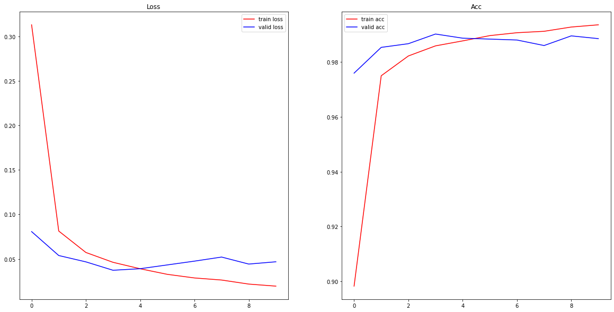

torch를 이용하여 CNN 모델을 구현했습니다. 이론보단 pytorch 활용 위주로 정리했습니다. 
 
### package import 
 
 
```python 
import os 
import time 
 
import numpy as np 
 
import torch 
from torch import nn 
from torch.utils.data import Dataset, DataLoader 
 
from torchvision import datasets, transforms 
 
import matplotlib.pyplot as plt 
``` 
 
### Data Prepare 
 
 
```python 
root = os.path.join(os.getcwd(), "data") 
 
mnist_train = datasets.MNIST( 
    root=root,                         
    train=True,                     
    download=True,                      
    transform=transforms.ToTensor() 
) 
mnist_test = datasets.MNIST( 
    root=root,  
    train=False,  
    download=True,  
    transform=transforms.ToTensor() 
)  
``` 
 
### Train / Val Split 
 
 
```python 
class mnist_dataset(Dataset): 
    def __init__(self, data, targets, transform=None, target_transform=None): 
        super().__init__() 
 
        self.data = data 
        self.targets = targets 
        self.transform = transform 
        self.target_transform = target_transform 
 
    def __len__(self): 
        return len(self.data) 
 
    def __getitem__(self, idx): 
        x, y = self.data[idx], self.targets[idx] 
        if self.transform: 
            x = self.transform(x) 
        if self.target_transform: 
            y = self.target_transform(y) 
 
        return x, y 
``` 
 
 
```python 
def split_train_valid(dataset, valid_ratio=0.1): 
 
    n_valid = int(len(dataset) * valid_ratio) 
    train_data = np.array(dataset.data[:-n_valid]) 
    valid_data = np.array(dataset.data[-n_valid:]) 
    train_targets = dataset.targets[:-n_valid] 
    valid_targets = dataset.targets[-n_valid:] 
 
    train = mnist_dataset(data=train_data, targets=train_targets, 
                          transform=dataset.transform, target_transform=dataset.target_transform) 
    valid = mnist_dataset(data=valid_data, targets=valid_targets, 
                          transform=dataset.transform, target_transform=dataset.target_transform) 
 
    return train, valid 
 
``` 
 
 
```python 
mnist_train, mnist_valid = split_train_valid(dataset=mnist_train) 
 
# DataLoader 정의 
train_loader = DataLoader(dataset=mnist_train, batch_size=64, shuffle=True, drop_last=True) 
valid_loader = DataLoader(dataset=mnist_valid, batch_size=64, shuffle=False, drop_last=True)    
test_loader = DataLoader(dataset=mnist_test, batch_size=64, shuffle=False, drop_last=True) 
``` 
 
### Data Check 
 
 
```python 
# train data example visualization 
fig = plt.figure(figsize=(10, 10)) 
for i in range(9): 
  img = mnist_train[i][0] 
  ax = fig.add_subplot(3, 3, i+1) 
  ax.imshow(img.reshape(28, 28), cmap="gray") 
fig.show() 
``` 
 
 
     
 
     
 
 
## CNN Classification 
 
 
### CNN model을 위한 class 
 
#### nn.Conv2d() 
 
- in_channels (int) – 입력 데이터의 채널 수 
 
- out_channels (int) – 합성곱 층이 출력하는 채널 수 
 
- kernel_size (int or tuple) – 합성곱망의 커널(필터) size. 
 
- stride (int or tuple, optional) – Stride, tuple이면 (수직이동 stride, 수평이동 stride), int면 (int,int)로 정의됨 
 
- padding (int, tuple or str, optional) – Default: 0, tuple이면 (높이 패딩, 너비 패딩), int면 (int,int)로 정의됨. str인 경우도 있는데 "same"인 경우 입력데이터와 출력데이터의 size가 동일하도록 패딩이 결정되고, "valid"인 경우는 0과 동일하다. 
 
- padding_mode (string, optional) – 'zeros', 'reflect', 'replicate' or 'circular'. Default: 'zeros' 
 
    - zeros : 0으로 패딩. ex) ex) [1,2,3] -> padding(2) -> [0,0,1,2,3,0,0] 
    - reflect : 양 끝에 거울처럼 반사된 값을 사용. ex) [1,2,3] -> padding(2) -> [3,2,1,2,3,2,1] 
    - replicate : 양 끝단의 값 사용.  ex) [1,2,3] -> padding(2) -> [1,1,1,2,3,3,3] 
    - circular : 값을 순서대로 사용.  ex) [1,2,3] -> padding(3) -> [1,2,3,1,2,3,1,2,3] 
 
- dilation (int or tuple, optional) – Default: 1, 커널 포인트 사이의 간격을 조정. 
 
- groups (int, optional) – 입력 데이터의 채널들을 그룹화 하여 그룹별로 출력하도록 설정. 
 
- bias (bool, optional) – Default: True, bias 추가 여부. 
 
#### nn.MaxPool2d() 
 
- kernel_size – Conv2d()와 의미는 동일. 
 
- stride – Conv2d()와 의미는 동일. 
 
- padding – Conv2d()와 의미는 동일. 
 
- dilation – Conv2d()와 의미는 동일. 
 
- return_indices – MaxUnpool2d()에 사용되는 indices를 제공. 
 
- ceil_mode – output size에 대해 바닥함수 대신 천장함수를 사용. 
 
 
```python 
# 간단한 CNN Classifier 모델 
 
class Lion_MNIST_CNN_Classifier(nn.Module): 
    def __init__(self, n_class=10): 
        super().__init__() 
 
        self.conv1 = nn.Conv2d(in_channels=1, out_channels=32, kernel_size=5, stride=1, padding=2) 
        self.conv2 = nn.Conv2d(32, 32, 3, stride=1, padding=1) 
        self.conv3 = nn.Conv2d(32, 32, 3, stride=1, padding=1) 
        self.relu = nn.ReLU() 
        self.pool = nn.MaxPool2d(kernel_size=2, stride=2, padding=0) 
        self.flatten = nn.Flatten() 
        self.fc1 = nn.Linear(3*3*32, 32) 
        self.fc2 = nn.Linear(32, 10) 
 
    def forward(self, x, visualize_filter=False): 
        conv1 = self.conv1(x) 
        _conv1 = self.pool(self.relu(conv1)) 
        conv2 = self.conv2(_conv1) 
        _conv2 = self.pool(self.relu(conv2)) 
        conv3 = self.conv3(_conv2) 
        _conv3 = self.pool(self.relu(conv3)) 
        conv3_vec = self.flatten(_conv3) 
        fc1 = self.fc1(conv3_vec) 
        out = self.fc2(self.relu(fc1)) 
 
        if not visualize_filter: 
            return out 
        else:                        
            return conv1, conv2, conv3, out 
``` 
 
 
```python 
cnn = Lion_MNIST_CNN_Classifier() 
``` 
 
 
```python 
## CNN 구조를 확인하기 위한 테스트 데이터 
sample_x = mnist_valid[0][0].unsqueeze(dim=0)    # unsqeeze : 데이터를 1차원 확장 --> dim 에 해당하는 차원으로 
print(sample_x.shape)                            # CNN의 input 이 (batch, channels, H, W) 꼴이므로 맞춰주기 위해 (batch=1)로 차원을 확장 
``` 
 
    torch.Size([1, 1, 28, 28]) 
 
 
 
```python 
conv1, conv2, conv3,out = cnn(sample_x, visualize_filter=True) 
print(conv1.shape, conv2.shape, conv3.shape, out.shape) 
``` 
 
    torch.Size([1, 32, 28, 28]) torch.Size([1, 32, 14, 14]) torch.Size([1, 32, 7, 7]) torch.Size([1, 10]) 
 
 
### Training CNN 
 
 
```python 
start_time = time.time()      # 현재 시각을 기록 
start_time 
``` 
 
 
 
 
    1654181415.8495317 
 
 
 
 
```python 
time_interval = time.time() - start_time     # start_time에서 지금까지 얼마나 시간이 흘렀는지를 초로 표현 
time_interval 
``` 
 
 
 
 
    1.7573089599609375 
 
 
 
 
```python 
# Trainer class 정의 
 
class Trainer(nn.Module): 
    def __init__(self, model, opt="adam", lr=0.001, has_scheduler=False, device="cpu"): 
        """ 
          Args: 
            model: 사용할 classification model 
            n_class: class 개수 
            opt: optimizer 
            lr: learning rate 
            has_scheduler: learning rate scheduler 사용 여부 
            device: 사용할 device (cpu/cuda) 
        """ 
        super().__init__() 
 
        # class 개수를 input으로 classification model 정의 
        self.model = model 
        self.loss = nn.CrossEntropyLoss()             # loss function 정의 
 
        self._get_optimizer(opt=opt.lower(), lr=lr)   # optimizer 정의 
        self.has_scheduler = has_scheduler            # scheduler 사용여부 
        if self.has_scheduler: 
            self._get_scheduler() 
 
        self.device = device                          # 사용할 device 
 
    def _get_optimizer(self, opt, lr=0.001): 
        """ 
          Args: 
            opt: optimizer 
            lr: learning rate 
        """ 
        if opt == "sgd": 
            self.optimizer = torch.optim.SGD( 
                params=self.model.parameters(), lr=lr) 
        elif opt == "adam": 
            self.optimizer = torch.optim.Adam( 
                params=self.model.parameters(), lr=lr) 
        else: 
            raise ValueError(f"optimizer {opt} is not supproted") 
 
    def _get_scheduler(self): 
        #     self.scheduler = torch.optim.lr_scheduler.StepLR(optimizer=self.optimizer, step_size=5, gamma=0.5, verbose=True) 
        self.scheduler = torch.optim.lr_scheduler.LambdaLR( 
            optimizer=self.optimizer, lr_lambda=lambda epoch: 0.95**epoch) 
 
    def train(self, train_loader, valid_loader, max_epochs=10, disp_epoch=5): 
        """ 
          네트워크를 학습시키는 함수 
          Args: 
            train_loader: 학습에 사용할 train dataloader 
            valid_loader: validation에 사용할 dataloader 
            max_epochs: 학습을 진행할 총 epoch 수 
            disp_epochs: 학습 log를 display 할 epoch 주기 
        """ 
        print("===== Train Start =====") 
        start_time = time.time() 
        history = {"train_loss": [], "train_acc": [], 
                   "valid_loss": [], "valid_acc": []} 
        for e in range(max_epochs): 
            train_loss, train_acc = self._train_epoch(train_loader) 
            valid_loss, valid_acc = self._valid_epoch(valid_loader) 
 
            # 현재 epoch에서 성능을 history dict에 저장 
            history["train_loss"].append(train_loss) 
            history["train_acc"].append(train_acc)        # 
            history["valid_loss"].append(valid_loss)      # 
            history["valid_acc"].append(valid_acc)        # 
 
            if self.has_scheduler:         # scheduler 사용할 경우 step size 조절 
                self.scheduler.step() 
 
            if e % disp_epoch == 0:        # disp_epoch 마다 결과값 출력 
                print(f"Epoch: {e}, train loss: {train_loss:>6f}, train acc: {train_acc:>3f}, valid loss: {valid_loss:>6f}, valid acc: {valid_acc:>3f}, time: {time.time()-start_time:>3f}") 
                start_time = time.time() 
 
        self.plot_history(history)       # 그래프 출력 
 
    def _train_epoch(self, train_loader): 
        """ 
          model를 training set 한 epoch 만큼 학습시키는 함수 
          Args: 
            train_loader: 학습에 사용할 train dataloader 
          Returns: 
            training set 한 epoch의 평균 loss, 평균 accuracy 
        """ 
        epoch_loss, epoch_acc = 0, 0 
        self.model.train()                 # self.model을 train 모드로 전환 --> nn.Module의 내장함수 
        for (x, y) in train_loader:        # x: data, y:label 
 
            x = x.to(self.device) 
            y = y.to(self.device) 
 
            y_hat = self.model(x)            # model이 예측한 label 
            loss = self.loss(y_hat, y) 
 
            self.optimizer.zero_grad()       # backwardpass를 통한 network parameter 업데이트 
            loss.backward()                  # 
            self.optimizer.step()            # 
 
            epoch_loss += loss.to("cpu").item() 
            epoch_acc += (y_hat.argmax(1) == 
                          y).type(torch.float).to("cpu").mean().item() 
 
        epoch_loss /= len(train_loader) 
        epoch_acc /= len(train_loader) 
 
        return epoch_loss, epoch_acc 
 
    def _valid_epoch(self, valid_loader): 
        """ 
          현재 model의 성능을 validation set에서 측정하는 함수 
          Args: 
            valid_loader: 학습에 사용할 valid dataloader 
          Returns: 
            validation set 의 평균 loss, 평균 accuracy 
        """ 
        epoch_loss, epoch_acc = 0, 0 
        self.model.eval()                  # self.model을 eval 모드로 전환 --> nn.Module의 내장함수 
        with torch.no_grad():              # model에 loss의 gradient를 계산하지 않음 
            for (x, y) in valid_loader: 
                x = x.to(self.device) 
                y = y.to(self.device) 
 
                y_hat = self.model(x) 
                loss = self.loss(y_hat, y) 
 
                epoch_loss += loss.to("cpu").item() 
                epoch_acc += (y_hat.argmax(1) == 
                              y).type(torch.float).to("cpu").mean().item() 
 
        epoch_loss /= len(valid_loader) 
        epoch_acc /= len(valid_loader) 
 
        return epoch_loss, epoch_acc 
 
    def plot_history(self, history): 
        """ 
          history에 저장된 model의 성능을 graph로 plot 
          Args: 
            history: dictionary with keys {"train_loss", "train_acc", "valid_loss", "valid_acc" } 
                     각 item 들은 epoch 단위의 성능 history의 list 
        """ 
        fig = plt.figure(figsize=(20, 10)) 
 
        ax = fig.add_subplot(1, 2, 1) 
        ax.plot(history["train_loss"], color="red", label="train loss") 
        ax.plot(history["valid_loss"], color="blue", label="valid loss") 
        ax.set_title("Loss") 
        ax.legend() 
 
        ax = fig.add_subplot(1, 2, 2) 
        ax.plot(history["train_acc"], color="red", label="train acc") 
        ax.plot(history["valid_acc"], color="blue", label="valid acc") 
        ax.set_title("Acc") 
        ax.legend() 
 
        fig.show() 
 
    def test(self, test_loader): 
        """ 
          현재 model의 성능을 test set에서 측정하는 함수 
          Args: 
            test_loader: 학습에 사용할 test dataloader 
          Returns: 
            test set 의 평균 loss, 평균 accuracy 
        """ 
        print("===== Test Start =====") 
        start_time = time.time() 
        epoch_loss, epoch_acc = 0, 0 
        self.model.eval()                  # self.model을 eval 모드로 전환 --> nn.Module의 내장함수 
        with torch.no_grad():              # model에 loss의 gradient를 계산하지 않음 
            for (x, y) in test_loader: 
                x = x.to(self.device) 
                y = y.to(self.device) 
 
                y_hat = self.model(x) 
                loss = self.loss(y_hat, y) 
 
                epoch_loss += loss.to("cpu").item() 
                epoch_acc += (y_hat.argmax(1) == 
                              y).type(torch.float).to("cpu").mean().item() 
 
        epoch_loss /= len(test_loader) 
        epoch_acc /= len(test_loader) 
 
        print( 
            f"Test loss: {epoch_loss:>6f}, Test acc: {epoch_acc:>3f}, time: {time.time()-start_time:>3f}") 
 
``` 
 
 
```python 
device = "cpu" 
cnn = Lion_MNIST_CNN_Classifier(n_class=10) 
trainer = Trainer(model=cnn, opt="adam", lr=0.001, has_scheduler=False, device=device).to(device) 
start_time = time.time() 
trainer.train(train_loader, valid_loader, max_epochs=10, disp_epoch=1) 
print(f"Training time : {time.time()-start_time:>3f}") 
trainer.test(test_loader) 
``` 
 
    ===== Train Start ===== 
    Epoch: 0, train loss: 0.312926, train acc: 0.898187, valid loss: 0.080712, valid acc: 0.975974, time: 15.386946 
    Epoch: 1, train loss: 0.081338, train acc: 0.975015, valid loss: 0.053835, valid acc: 0.985383, time: 14.975269 
    Epoch: 2, train loss: 0.057269, train acc: 0.982243, valid loss: 0.046714, valid acc: 0.986727, time: 15.583878 
    Epoch: 3, train loss: 0.046209, train acc: 0.985932, valid loss: 0.037290, valid acc: 0.990255, time: 15.813884 
    Epoch: 4, train loss: 0.038972, train acc: 0.987748, valid loss: 0.039034, valid acc: 0.988743, time: 15.452708 
    Epoch: 5, train loss: 0.032710, train acc: 0.989676, valid loss: 0.043285, valid acc: 0.988407, time: 15.199469 
    Epoch: 6, train loss: 0.028654, train acc: 0.990733, valid loss: 0.047538, valid acc: 0.988071, time: 15.354423 
    Epoch: 7, train loss: 0.026315, train acc: 0.991251, valid loss: 0.052116, valid acc: 0.986055, time: 15.331181 
    Epoch: 8, train loss: 0.021769, train acc: 0.992808, valid loss: 0.044240, valid acc: 0.989583, time: 15.307674 
    Epoch: 9, train loss: 0.019460, train acc: 0.993624, valid loss: 0.046812, valid acc: 0.988575, time: 15.343253 
    Training time : 153.776148 
    ===== Test Start ===== 
    Test loss: 0.037516, Test acc: 0.988782, time: 2.021699 
 
 
 
     
 
     
 
 
### Model Save/Load 
 
 
```python 
## State dict 
# 모델의 state_dict 출력 
print("Model's state_dict:") 
for param_tensor in cnn.state_dict(): 
    print(f"{param_tensor}, \t {cnn.state_dict()[param_tensor].size()}") 
``` 
 
    Model's state_dict: 
    conv1.weight, 	 torch.Size([32, 1, 5, 5]) 
    conv1.bias, 	 torch.Size([32]) 
    conv2.weight, 	 torch.Size([32, 32, 3, 3]) 
    conv2.bias, 	 torch.Size([32]) 
    conv3.weight, 	 torch.Size([32, 32, 3, 3]) 
    conv3.bias, 	 torch.Size([32]) 
    fc1.weight, 	 torch.Size([32, 288]) 
    fc1.bias, 	 torch.Size([32]) 
    fc2.weight, 	 torch.Size([10, 32]) 
    fc2.bias, 	 torch.Size([10]) 
 
 
 
```python 
# Save 
model_dir = os.path.join(os.getcwd()) 
if not os.path.exists(model_dir): os.makedirs(model_dir)    # model_dir 이 없을 경우 생성해줌 
torch.save(cnn.state_dict(), os.path.join(model_dir, "Lion_MNIST_CNN_Classifier.pth")) 
``` 
 
 
```python 
# 학습되지 않은 model test 성능 
 
device = "cpu" 
cnn_load = Lion_MNIST_CNN_Classifier(n_class=10) 
trainer_not_load = Trainer(model=cnn_load, opt="adam", lr=0.001, has_scheduler=False, device=device).to(device) 
trainer_not_load.test(test_loader) 
``` 
 
    ===== Test Start ===== 
    Test loss: 2.305659, Test acc: 0.113482, time: 2.046459 
 
 
 
```python 
# Load model 
 
model_path = os.path.join(model_dir, "Lion_MNIST_CNN_Classifier.pth") 
print(model_path) 
cnn_load.load_state_dict(torch.load(model_path)) 
cnn_load.eval() 
``` 
 
    /home/nackta/python_project/socar_bootcamp/Lion_MNIST_CNN_Classifier.pth 
 
 
 
 
 
    Lion_MNIST_CNN_Classifier( 
      (conv1): Conv2d(1, 32, kernel_size=(5, 5), stride=(1, 1), padding=(2, 2)) 
      (conv2): Conv2d(32, 32, kernel_size=(3, 3), stride=(1, 1), padding=(1, 1)) 
      (conv3): Conv2d(32, 32, kernel_size=(3, 3), stride=(1, 1), padding=(1, 1)) 
      (relu): ReLU() 
      (pool): MaxPool2d(kernel_size=2, stride=2, padding=0, dilation=1, ceil_mode=False) 
      (flatten): Flatten(start_dim=1, end_dim=-1) 
      (fc1): Linear(in_features=288, out_features=32, bias=True) 
      (fc2): Linear(in_features=32, out_features=10, bias=True) 
    ) 
 
 
 
 
```python 
# Load 한 model test 성능 
 
device = "cpu" 
trainer_load = Trainer(model=cnn_load, opt="adam", lr=0.001, has_scheduler=False, device=device).to(device) 
trainer_load.test(test_loader) 
``` 
 
    ===== Test Start ===== 
    Test loss: 0.037516, Test acc: 0.988782, time: 1.675741 
 
